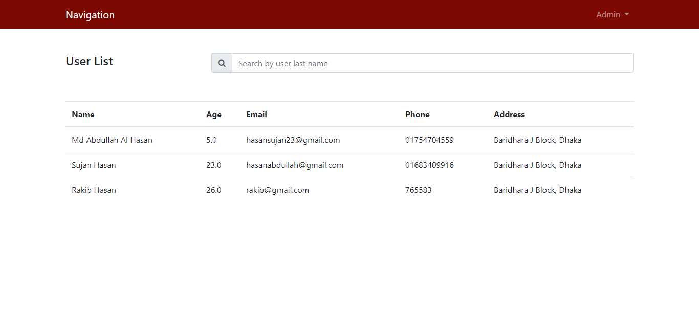

# Project Title:
**Simple User Portal Using Grails**

# Getting Strated
These instructions will get you a copy of the project up and running on your local machine for development and testing purposes. See deployment for notes on how to deploy the project on a live system.

# Prerequisites

<table>
	<thead>
		<tr>
			<th>Tools & Technology</th>
			<th>Version</th>
		</tr>
	</thead>
	<tbody>
		<tr>
			<td>Grails</td>
			<td>3.3.11</td>
		</tr>
		<tr>
			<td>Groovy</td>
			<td>3.0.0-beta-3</td>
		</tr>
		<tr>
			<td>JAVA</td>
			<td>1.8.0_102</td>
		</tr>
		<tr>
			<td>Database</td>
			<td>MySql</td>
		</tr>
	</tbody>
</table>

# Installing
Follow the steps to install the project in your local environment.

- Goto your phpmyadmin panel and create a database named portaldb.
- Then goto application.yml file and change username or password.
- If you change the database name in phpmyadmin then you have to change the database name in application.yml file also.

# Project Demo
**Login Page :**
 

**Registration Page :**

**User Profile Page :**

**Change password Page :**

**Admin Page :**
